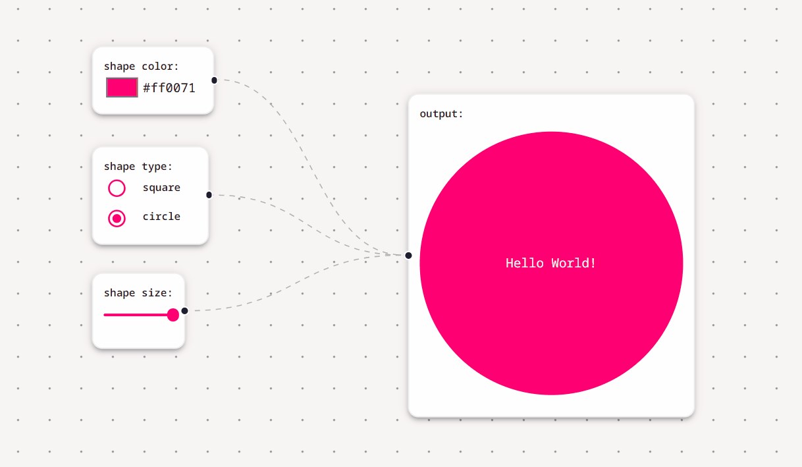

# Shape Shifter App

This is a simple app that allows users to modify the size, color, and shape of an object using Reactflow. You can try it [here](https://shape-shifter-puce.vercel.app/). 

## Features

1. **shapesize**: Modifies the size of the shape.
2. **shapeColor**: Modifies the color of the shape.
3. **shape**: Modifies the type of shape.

## Setup Instructions

1. Clone the repository.
2. Navigate to the project directory.
3. Run `npm install` to install dependencies.
4. Run `npm run dev` to start the app.

## Usage
1. Use the `shapesize` feature to adjust the size of the shape.
2. Utilize the `shapeColor` feature to change the color of the shape.
3. Experiment with the `shape` feature to modify the type of shape.

## Note

This app utilizes Reactflow, which provides a simple way to build flowcharts and node-based graphs.
